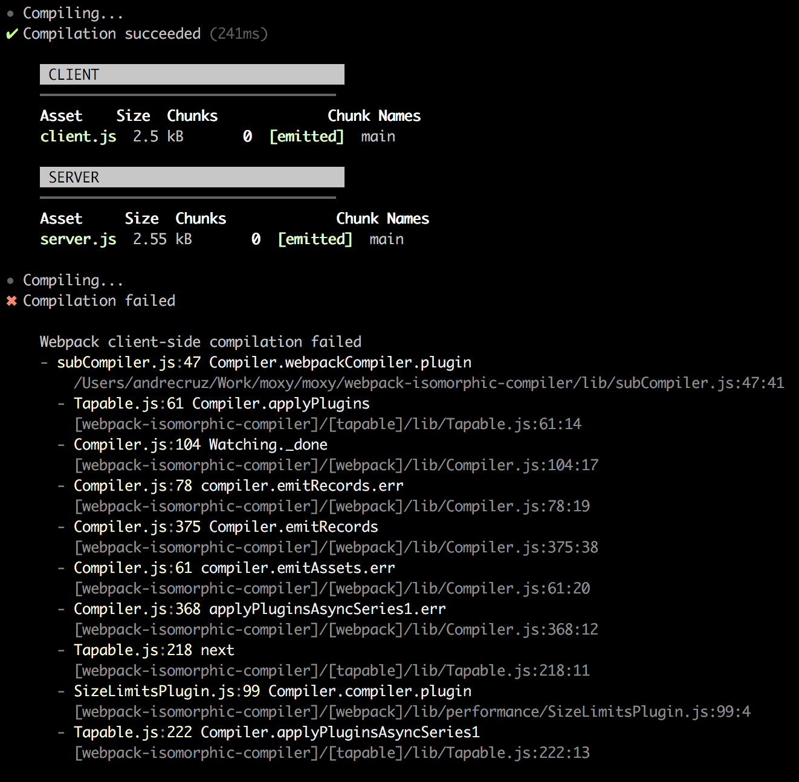
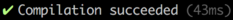
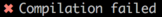
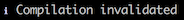
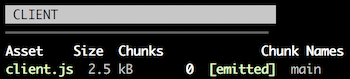
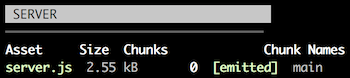
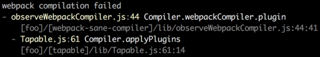

# webpack-isomorphic-compiler-reporter

[![NPM version][npm-image]][npm-url] [![Downloads][downloads-image]][npm-url] [![Build Status][travis-image]][travis-url] [![Coverage Status][codecov-image]][codecov-url] [![Dependency status][david-dm-image]][david-dm-url] [![Dev Dependency status][david-dm-dev-image]][david-dm-dev-url] [![Greenkeeper badge][greenkeeper-image]][greenkeeper-url]

[npm-url]:https://npmjs.org/package/webpack-isomorphic-compiler-reporter
[npm-image]:http://img.shields.io/npm/v/webpack-isomorphic-compiler-reporter.svg
[downloads-image]:http://img.shields.io/npm/dm/webpack-isomorphic-compiler-reporter.svg
[travis-url]:https://travis-ci.org/moxystudio/webpack-isomorphic-compiler-reporter
[travis-image]:http://img.shields.io/travis/moxystudio/webpack-isomorphic-compiler-reporter/master.svg
[codecov-url]:https://codecov.io/gh/moxystudio/webpack-isomorphic-compiler-reporter
[codecov-image]:https://img.shields.io/codecov/c/github/moxystudio/webpack-isomorphic-compiler-reporter/master.svg
[david-dm-url]:https://david-dm.org/moxystudio/webpack-isomorphic-compiler-reporter
[david-dm-image]:https://img.shields.io/david/moxystudio/webpack-isomorphic-compiler-reporter.svg
[david-dm-dev-url]:https://david-dm.org/moxystudio/webpack-isomorphic-compiler-reporter?type=dev
[david-dm-dev-image]:https://img.shields.io/david/dev/moxystudio/webpack-isomorphic-compiler-reporter.svg
[greenkeeper-image]:https://badges.greenkeeper.io/moxystudio/webpack-isomorphic-compiler-reporter.svg
[greenkeeper-url]:https://greenkeeper.io

Beautiful reporting for [webpack-isomorphic-compiler](https://github.com/moxystudio/webpack-isomorphic-compiler) compilation events.

While [webpack-sane-compiler-reporter](https://github.com/moxystudio/webpack-sane-compiler-reporter) works fine with this compiler, the output is incomplete. This reporter is specially designed to be isomorphic aware.




## Installation

`$ npm install webpack-isomorphic-compiler-reporter --save-dev`


## Usage

```js
const startReporting = require('webpack-isomorphic-compiler-reporter');

const { stop, options } = startReporting(compiler, {/* options */});

// Now, just call compiler.run() or compiler.watch() to start a compilation and start outputting reports
// Calling stop() will stop listening to the compiler events
// Furthermore, you have access to the options that were computed by the merge of provided options and the defaults
```

### Available options

| Name   | Description   | Type     | Default |
| ------ | ------------- | -------- | ------- |
| stats | Display webpack stats after each compilation | boolean/string (`true`, `false` or `'once'`) | true |
| humanErrors| Detects human errors related to webpack configuration mistakes (done only once) | boolean | true |
| write | Function responsible for printing/outputting the generated report messages | function | Prints to `stderr` |
| [printStart](https://github.com/moxystudio/webpack-sane-compiler-reporter/blob/a90fa12ab05508bb7e000612953c35321d28be4d/index.js#L19) | Function responsible for generating a message for when a compilation starts | function |  |
| [printSuccess](https://github.com/moxystudio/webpack-sane-compiler-reporter/blob/a90fa12ab05508bb7e000612953c35321d28be4d/index.js#L20) | Function responsible for generating a message when a compilation succeeds | function |  |
| [printFailure](https://github.com/moxystudio/webpack-sane-compiler-reporter/blob/a90fa12ab05508bb7e000612953c35321d28be4d/index.js#L21) | Function responsible for generating a message when a compilation fails | function |  |
| [printInvalidate](https://github.com/moxystudio/webpack-sane-compiler-reporter/blob/a90fa12ab05508bb7e000612953c35321d28be4d/index.js#L22) | Function responsible for generating a message when [invalidate()](https://github.com/moxystudio/webpack-sane-compiler#watchoptions-handler) was called when watching | function |  |
| [printStats](https://github.com/moxystudio/webpack-isomorphic-compiler-reporter/blob/9d58314ea56431a6dd2d633b32a9cc720bed301c/index.js#L13) | Function responsible for generating a message representing a WebpackStats instance | function |   |
| [printError](https://github.com/moxystudio/webpack-sane-compiler-reporter/blob/a90fa12ab05508bb7e000612953c35321d28be4d/index.js#L24) | Function responsible for generating a message of a Error instance | function |  |


### Other exports

#### renderers

For convenience this package also exports the [renderers](lib/renderers.js) used internally:

```js
const reporter = require('webpack-isomorphic-compiler-reporter');

reporter(compiler, {
    printError: (err) => `${reporter.renderers.renderError(err)}\n`,
});
```

#### symbols

You can also access the [symbols](lib/symbols.js) that precede some messages.

```js
const reporter = require('webpack-isomorphic-compiler-reporter');

reporter(compiler, {
    printStart: () => `${reporter.symbols.start} A iniciar a compilação...\n`,
});
```


## Tests

`$ npm test`   
`$ npm test -- --watch` during development


## License

[MIT License](http://opensource.org/licenses/MIT)
